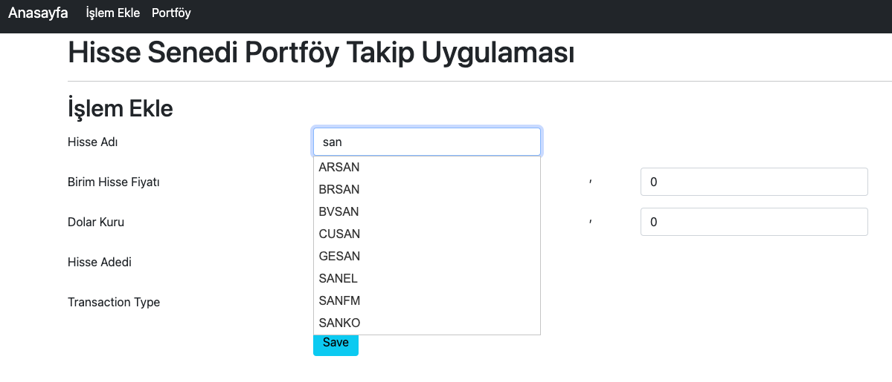
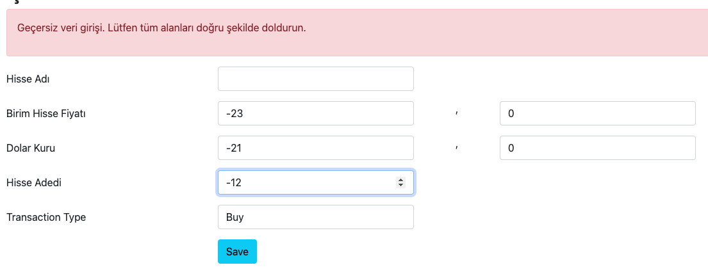
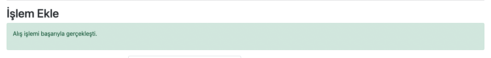
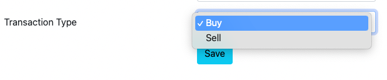
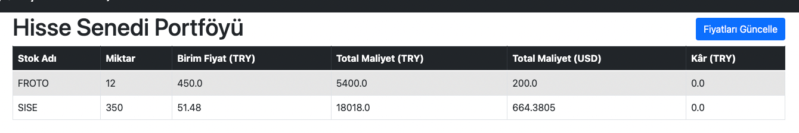
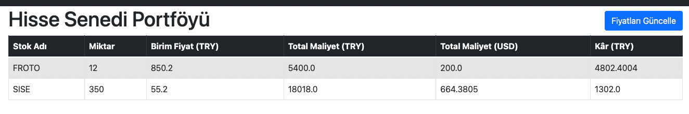

# manage-stock-market-portfolio
- Download and put under resourses the 'tumhisse.xlsx' file from https://www.isyatirim.com.tr/tr-tr/analiz/hisse/Sayfalar/default.aspx
- Every successful transaction process is stored in 'transaction' table.
- After transaction proecess, every stocks added-substracted according to 'portfolio' table.

- Filter Stocks from CSV.

- Exception handling for wrong input like minus price, minus stcok amount.

- Success message after successful process.

- Add buy-sell process

- Show portfolio

- After clicked blue buttor, update profit according to csv file.
